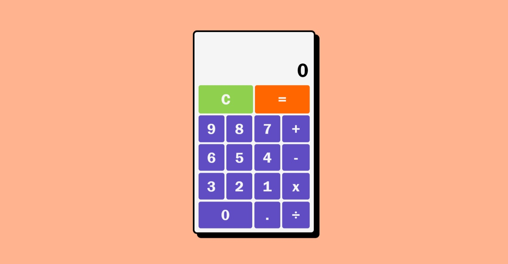

# Calculator with JS

A Calculator app with html css javascript

    
     
    <a href="https://satyabrata-saha.github.io/calculator-with-js/">
    <button style="
    background-color: #8FD14F;
    border: none;
    font-weight: 800;
    color: white;
    padding: 10px 20px;
    font-size: 16px;
    margin: 4px 2px; 
    cursor: pointer;
    border-radius: 8px; 
" 
    onmouseover="this.style.backgroundColor='#45a049'"
    onmouseout="this.style.backgroundColor='#4CAF50'">
    Website Link
    </button>
    </a>

